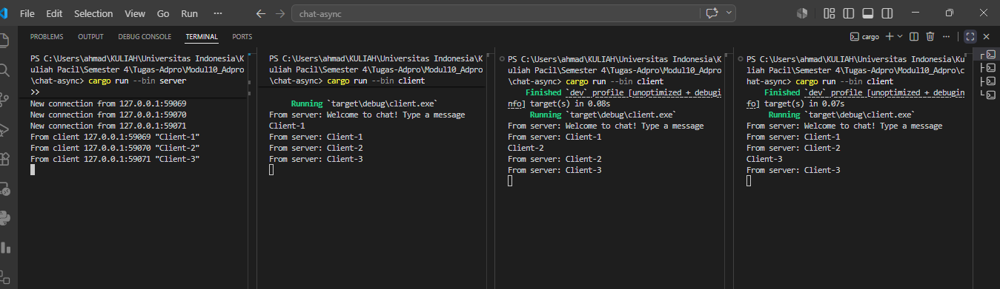
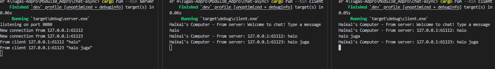

# Reflection
## Experiment 2.1

### How to run Server:
- **Jalankan server** (dari direktori `chat-async`):
```bash
cargo run --bin server
```
Server akan mulai dan mendengarkan pada port `2000`.
- **Jalankan client** (di terminal terpisah, ulangi untuk beberapa client):
```bash
cargo run --bin client
```
Setiap client dapat mengirim pesan.

### What happened when client sent message
1. Client mengirim pesan ke server melalui koneksi WebSocket ketika client menekan Enter.
2. Server menerima pesan dan mencatat log, misalnya: `From client 127.0.0.1:59069 "Client-1"`.
3. Server meneruskan pesan tersebut ke semua client yang terhubung menggunakan channel broadcast (mis. `tokio::sync::broadcast`).
4. Semua client yang terhubung menerima broadcast dan menampilkan pesan dari server, misalnya: `From server: Client-2`.

## Experiment 2.2: Modifying Port
Komunikasi disini melibatkan antara client dan server sehingga perubahan port harus dilakukan di kedua sisi.
1. Client Side (`src/bin/client.rs`): Protokol WebSocket yang dipakai adalah `ws://` dan didefinisikan pada URI client.
```Rust
ClientBuilder::from_uri(Uri::from_static("ws://127.0.0.1:8080"))
            .connect()
            .await?;
```
2. Server Side (`src/bin/server.rs`): server menerima koneksi WebSocket melalui `ServerBuilder::new().accept(socket)`
```Rust
    let listener = TcpListener::bind("127.0.0.1:8080").await?;
    println!("listening on port 8080");
```

## Experiment 2.3

### Explanation:
Modifikasi yang saya lakukan adalah menambahkan identitas pengirim pada pesan broadcast, karena belum ada nama user dan menambahkan ip asalnya. Hal tersebut dilakukan dengan:

- Server menambahkan alamat IP:port pengirim ke isi pesan yang dibroadcast (lihat [src/bin/server.rs](src/bin/server.rs#L26)).
- Client menambahkan label perangkat lokal saat menampilkan pesan dari server (lihat [src/bin/client.rs](src/bin/client.rs#L18)).

Hasil yang terlihat di terminal client setelah perubahan, ketika salah satu mengirimkan pesan:

```text
Haikal's Computer - From server: 127.0.0.1:61112: halo
```

Alasan perubahan: Karena sebelumnya tanpa nama user, dan menampilkan alamat IP:port supaya membantu membedakan sumber pesan ketika banyak pesan ditampilkan di client.
